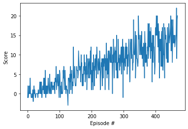

# Project Report

## Introduction

This project deals with building a reinforcement learning agent to solve a modified version of the Banana Collector task of UnityML.

The environment is a space containing blue and yellow bananas. The goal of the agent is to collect as many yellow bananas as possible while avoiding blue bananas. A reward of +1 is given for collecting a yellow banana and a reward of -1 is given for a blue banana. 

The state space of the environment is an array of 37 elements containing the agent's velocity among other metrics. There are four possible actions: 

- **`0`** - move forward.
- **`1`** - move backward.
- **`2`** - turn left.
- **`3`** - turn right.

The task is episodic. To solve the environment, the agent must obtain an average score greater than or equal to 13 over 100 consecutive episodes. 

## Learning Algorithm

The algorithm used is a Deep Q network with two neural networks, one to represent the parameters of the state-action value and the other used as a target for updating the parameters. The architecture of both neural network is **state_space_size x 64 neurons x 64 neurons x action_space_size**. Since the *state_space_size* is **37**, and the *action_space_size* is **4**, the input layer has a size of 37 and the output layer is of size 4. The hidden layers of the neural networks use **relu activation functions**.   

Since the task is episodic, a maximum of **2000 episodes** was set in order to train the agent. The maximum time step in each episode is set at **1000** with the agent learning every fourth time step (while saving as expericence to a replay buffer, the states, action and rewards obtained in between every fourth time step). The replay buffer size from which data from training is sampled is set at **1e5**. Other parameters used include a **batchsize of 64** used for sampling from the experience buffer, a discount factor of **0.99** and a learning rate of **5e-4** for updating the parameters of the local network. Finally an interpolation parameter of $\tau = 1e-3$ was used in updating the parameters of the target neural network. 

The implementation of the agent is an Agent class implemented in the *banana_agent.py* file. This class initializes the two neural networks used in the algorithm and the replay buffer class (also contained in *banana_agent.py*) used for storing the experiences that will be sampled and learned from. In addition, the Agent class defines various function for the agent. These include: the **step** function, which steps over each time step and either learns or stores the experience from that time step; the **act** function which chooses an action; the **learn** function which learns from the experience sampled from the replay buffer; and finally the **soft_update** function which updates the target neural network. The neural network architecture used is implemented using pytorch and contained in the *banana_model.py* file. 

The Agent class is then used in the Navigation.ipynb notebook for training the agent in the **dqn()** function (after initializing the banana linux environment). The parameters of the trained local neural network of the agent is stored in the *checkpoint.pth* and can be reloaded at a later time for use.  

## Results Obtained
The environment is considered solved when the agent obtains an average score of at least 13 over the last 100 consecutive episodes. The implementation contained in this projects managed to solve the task in just **369 episodes**, obtaining an average of **13.09** over the previous 100 consecutive episodes. An evolution of the rewards obtained over the episodes while training is shown below: 

## Future Imporvement
An obvious improvement I would like to try is to use only the pixels of pictures obtained from the environment for training the agent rather than use state vectors obtained from the environment. 
